# bOS — a folder OS

**A personal operating system that is just a folder. And it proves what it claims.**

Your tasks, finances, habits, goals and confirmed memory live in plain markdown files on your machine. An AI CLI opens the folder and becomes your operator: it plans your day, logs what you mention in passing, remembers what you confirm, and refuses to do dangerous things without asking. No server, no database, no daemon, no account.

Three things make it different from every other "AI life OS":

1. **It is a folder, not a platform.** Markdown and bash. Works in Claude Code (full enforcement), Codex and Grok (reduced wiring). You can read every byte of your "OS", grep it, back it up, or leave — the files are yours either way.
2. **Guardrails are code, not promises.** Where a rule can be enforced, it is a hook that blocks the action before it happens — hand-edits of memory, destructive ops on archives, `git push` from chat. CI feeds the guards hostile payloads on every push. Where a rule is only a prompt, [HONESTY.md](HONESTY.md) says so out loud.
3. **Honesty is a feature.** A maintained table of what is REAL, what is best-effort, and what does not exist. Memory with declared provenance and conflict quarantine instead of "the AI just remembers". External audit reports committed to [docs/audits/](docs/audits/), including the failed rounds.

> **v0.14.0** — `git clone https://github.com/zmrlk/bOS.git`

## What a session looks like



*(example session — Alex is the fixture persona from `/setup`)*

```
> morning
☀️ Morning, Alex. Yesterday's evening energy: 5/10 — lighter plan today.
🗓️ TODAY: 10:00 dentist · 14:00 call with Sam
✅ PLAN (max 3 — that's the rule, not a suggestion)
   1. Send Sam the invoice draft (~45 min)
   2. Book the car service (5 min — quick win, do it first)
   3. Read ch. 4 (only if energy holds)

> btw spent 40 on lunch
⏳ Logged: 40 (Food) → state/finances.md.

> remember that I want the answer first, then evidence
💾 Saved → memory/current/user--answer-style.md

⏭️ Next step: the invoice draft. One thing. Just one.
```

Everything above is a file you can open: the plan reads `state/tasks.md`, the expense lands in `state/finances.md`, the memory is a markdown record with a hash and a source.

## How it works

| Layer | What it is | Where |
|-------|-----------|-------|
| **State** | Your live data: tasks, finances, habits, goals, daily log | `state/*.md` — plain markdown, gitignored, never leaves your disk |
| **Skills** | 24 repeatable workflows (`/morning`, `/expense`, `/remember`, `/ship`, …) | `.claude/skills/` — each one a readable SKILL.md |
| **Agents** | One orchestrator (@boss) plus nine specialists (@cto, @coach, @finance, …) | `.claude/agents/` — roles of one model, not separate processes |
| **Hooks** | Code that runs around the model: context injection at session start, write guards, session close | `.claude/hooks/` — 6 wired, tested in CI |
| **Memory** | Durable cross-CLI store with provenance, hashes and conflict quarantine | `memory/` — one helper script is the only writer |
| **Bus** | Cross-session signals through one schema-validating writer | `state/context-bus.jsonl` |

The model reads the contract ([AGENTS.md](AGENTS.md)), the hooks enforce what they can, and the rest is honest prompting. That split — and the discipline of documenting it — is the design.

## What it actually does for you

- **Plans with your energy, not just your calendar.** `/morning` builds a max-3 plan from your tasks, calendar and yesterday's energy. Defaults are built for real humans: three visible tasks, streaks that decay instead of resetting to zero, quick wins first.
- **Catches what you say in passing.** Mention an expense, a workout, a finished task mid-conversation and it lands in the right file with a `⏳ Logged:` confirmation. Best-effort by design, and labelled as such.
- **Remembers only what you confirm.** `/remember` writes a record with source and hash. Conflicting facts are quarantined, never silently overwritten. Session summaries and web content never become "truth" on their own.
- **Stands between you and expensive mistakes.** Spending advice reads your actual buffer first. Sending, paying, deleting, pushing — always a separate explicit yes, defaulting to dry-run.
- **Survives the tool you use.** The same folder works across three AI CLIs. If one vendor changes course, your OS is still a folder.

## Why not the alternatives

No names, just categories — judge for yourself:

| Category | What you get | What bOS does instead |
|----------|-------------|----------------------|
| Prompt-pack "life OS" templates | A large system prompt and hope. Every rule is a promise the model may forget. | Rules that matter are hooks with exit codes, tested against hostile payloads in CI. The rest is labelled best-effort. |
| Autonomous agent frameworks | Maximum autonomy: daemons, schedulers, agents acting while you sleep. | Maximum trust: no daemon, no background actions, destructive ops always ask. It acts *with* you in session. |
| AI memory layers / vector stores | Black-box recall. Model-generated summaries get promoted to facts. | Inspectable markdown records with declared provenance. Lexical search you can verify with grep. Conflicts quarantined, not averaged. |
| Hosted life dashboards | Your data on their server, their pricing, their roadmap. | Local files, gitignored, MIT-licensed. Leaving costs you nothing because there is nothing to leave. |

The honest trade-off: bOS will not act while you are away, will not sync to your phone by itself, and its routing is ~60-80% accurate, not 100%. If you want a fully autonomous cloud agent, this is not it — deliberately.

## Guardrails — what is code, what is contract

- **Code (hook):** a PreToolUse guard blocks hand-edits of the message bus and durable memory, destructive ops on archives, and in-session `settings.json` edits — fed hostile payloads in CI on every push. It's a speed bump against the model's mistakes, not a security boundary ([HONESTY.md](HONESTY.md) says exactly where the line is).
- **Code (boundary):** your data lives in untracked `state/` files — git never sees them, so a commit or push cannot ship them.
- **Code (memory):** one local store works across Claude/Codex/Grok; conflicts quarantine instead of overwriting, stale records leave the startup cache, and known secret/crisis/injection patterns are rejected. Provenance is auditable, not cryptographically proven. See [docs/MEMORY.md](docs/MEMORY.md).
- **Code (permissions, Claude Code):** `git push`, `rm`, `sudo`, `curl` are deny-listed in chat; destructive actions require a separate, explicit yes.
- **Contract (prompt, all hosts):** crisis conversations are never persisted — no notes, no logs, external hotlines instead (the crisis rule — AGENTS.md rule 9). Send/spend consent on non-Claude hosts is also contract, not hook.
- Every claim is auditable from disk: `bash scripts/bos-roster.sh` + `bash tests/run.sh`. Full breakdown: [HONESTY.md](HONESTY.md).

## Quick start

1. Install [Claude Code](https://claude.ai/code) (or Codex CLI / Grok CLI — reduced wiring, see [HONESTY.md](HONESTY.md)).
2. `git clone https://github.com/zmrlk/bOS.git` and open the folder in your CLI.
3. Say "hi". If `profile.md` is empty, the session-start hook prints a hard `SETUP REQUIRED` and `/setup` runs — detection-first, max 5 questions, under 3 minutes on Claude Code (Codex/Grok use numbered lists instead of clickable cards and take longer). Not sure yet? Setup offers a 30-second demo on sample data first — try `/morning` on the fixture, then it wipes itself.

Windows note: `.agents/skills/` uses git symlinks — clone with `git clone -c core.symlinks=true …` (needs Developer Mode or admin).

To message a running session from outside: write one line into `state/ping.md`. It is consumed on the next turn.

## Team

Ten agent files, one orchestrator. Conversational titles (ceo, coo, sales, …) are **personas of @boss**, not separate agents.

| Area | Agents |
|------|--------|
| Core | @boss |
| Business | @cto @cmo @advocate |
| Design | @design |
| Life | @coach @finance |
| Health | @trainer @diet |
| Learning | @reader |

## Message bus

Cross-session signals go through one schema-validating writer:

```bash
bash scripts/context-bus-append.sh <from> <to> <type> <priority> "<content>" [ttl_days]
```

Hand-appending the jsonl is blocked by the guard hook. The live bus file is gitignored — your signals never ship with the repo.

## Durable memory

`/remember` saves only explicitly confirmed facts. `memory/current/` holds the
current value, incompatible proposals go to `memory/conflicts/`, superseded
versions go to `memory/archive/`, and a small `memory/HOT.md` is loaded at
session start. `/recall` reports file/source locators and falls back to session
history. The store is local, gitignored, and shared by all three CLIs.

It is deliberately lexical and inspectable — no vector database and no claim
that a model-generated session summary is automatically true. Full design:
[docs/MEMORY.md](docs/MEMORY.md).

## Optional extras

Everything under `examples/` is a sample, not a dependency: ntfy push notifications for macOS, a Supabase mirror schema, n8n workflow templates, and two skills (`vault`, `schedule`) that need extra setup before they are safe to enable. A fresh clone works without any of it.

Secrets live in a local `.secrets/` directory you create yourself (`chmod 700`, files `600`) — never paste keys into chat.

## Limits

These are system limits, not footnotes:

- **"OS" is a metaphor.** In practice bOS is a folder + a contract + hooks, with **one reference host**: Claude Code gets full enforcement, Codex gets context injection, Grok gets prompt-only compliance, Windows is unsupported until its CI job is green. There is no daemon and nothing runs while your session is closed.
- **Provenance is asserted, not proven.** The memory helper rejects raw `web:`/`model:` sources and known secret patterns, but it cannot verify that a model honestly labelled a record `user:`. On Codex and Grok, where no write guard exists, that assertion is the only line of defense.
- **Routing is ~60-80%, and memory does not fix it.** One model wearing ten roles misroutes sometimes, and it can still "remember" things outside the store in a given conversation. The store is the auditable arbiter you check against — not a guarantee of what the model says.
- **Data quality equals what you tell it.** Nothing is captured that you didn't say.

Privacy model: [PRIVACY.md](PRIVACY.md). What's real vs. aspirational: [HONESTY.md](HONESTY.md). Cross-CLI contract: [AGENTS.md](AGENTS.md).

License: [MIT](LICENSE).
